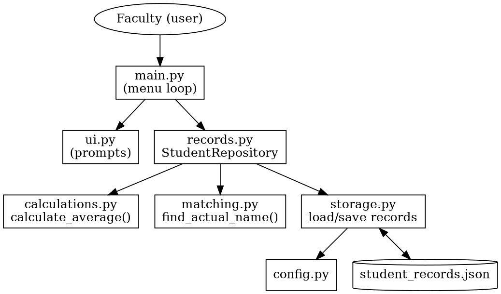
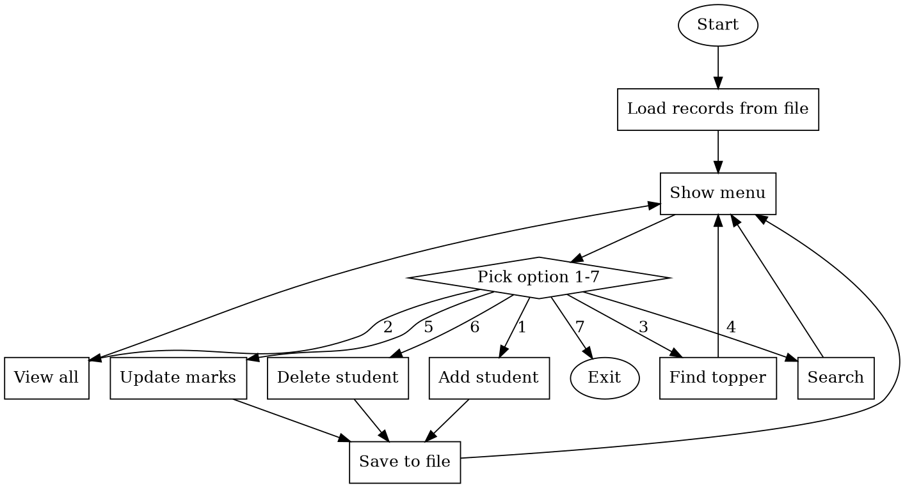
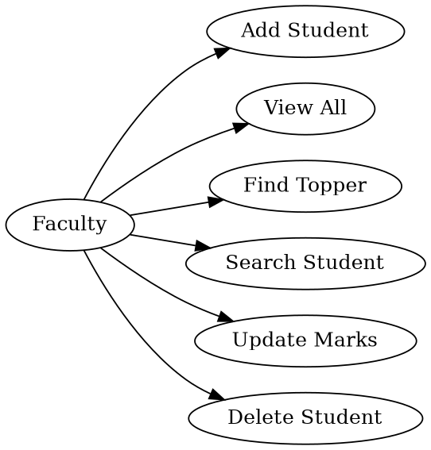
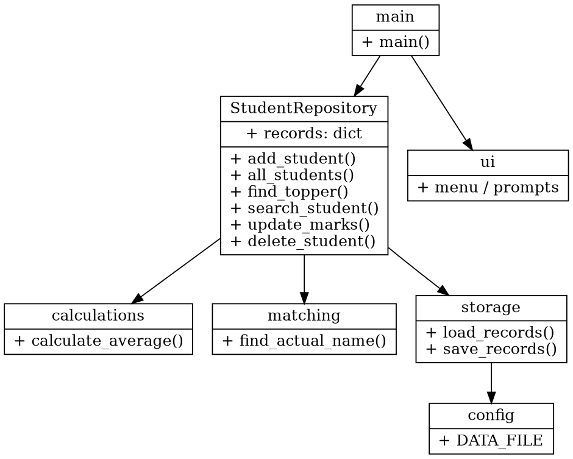
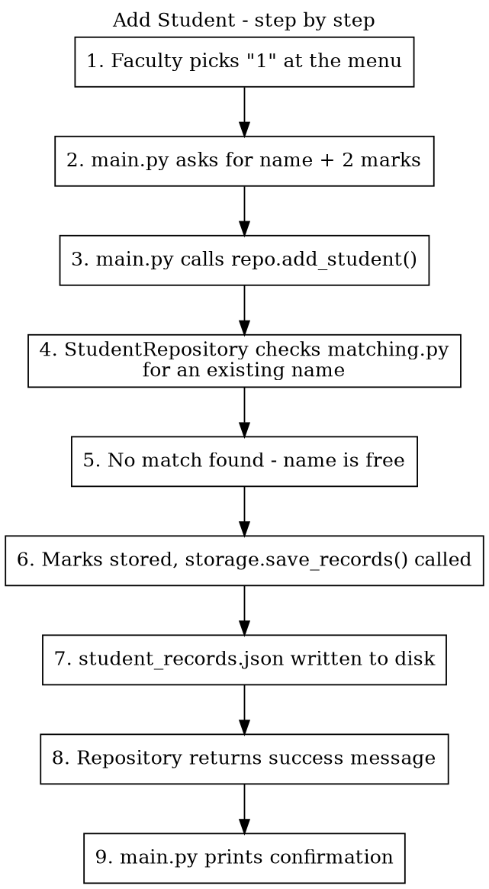
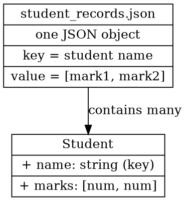

# Design Documentation - Academic Record Helper

This is my write-up of how I designed the project - the problem I was
solving, the requirements, the architecture, and the diagrams. I'm
keeping this separate from the code comments since just commenting the
code isn't the same as actually documenting it (my faculty pointed this
out on my last submission).

## 1. Problem Statement

Faculty calculate student averages and find the topper by hand a lot of
the time, which is slow and can hide ties for first place. Records also
don't really "exist" anywhere once you close the notebook or
spreadsheet. This project automates the calculation part and keeps the
records saved between runs.

## 2. Objectives

- Let a faculty member add, view, search, update and delete student
  marks from a simple menu.
- Calculate averages using one function everywhere, instead of
  repeating the same loop.
- Correctly show the topper, including when there's a tie.
- Match names without caring about uppercase/lowercase.
- Save records to a file so nothing is lost when the program closes.

## 3. Functional Requirements

| # | Requirement |
|---|-------------|
| F1 | Add a student with a name and two subject marks |
| F2 | View every student's marks and their average |
| F3 | Find the topper - show everyone if there's a tie |
| F4 | Search for a student, regardless of case |
| F5 | Update a student's marks |
| F6 | Delete a student |
| F7 | Save records automatically and load them back next time |

I think of this as three main parts: managing records (add/update/
delete), reporting (view all/find topper), and saving/loading the data.

## 4. Non-Functional Requirements

| # | Requirement | How I handled it |
|---|-------------|----------------|
| NF1 | Usability | Simple numbered menu (1-7), plain messages, no commands to remember |
| NF2 | Reliability | Bad input (blank name, letters instead of numbers, unknown student) is caught with try/except instead of crashing |
| NF3 | Maintainability | Split into 6 files by what they do, so I can fix one thing without touching the rest |
| NF4 | Error handling | Every input and file operation that could fail has a try/except with a clear message |
| NF5 | Resource use | Just a dictionary in memory and a small JSON file - more than enough for a class-sized list of students |

## 5. System Architecture

The program is split into layers - the menu/prompts (`main.py`,
`ui.py`) call into `StudentRepository` in `records.py`, which uses
`calculations.py` and `matching.py` for the actual math and name
matching, and `storage.py` to read/write the JSON file.



## 6. Process Flow / Workflow Diagram

Basically: load whatever was saved before, show the menu in a loop, do
whatever the user picked, save if anything changed, and go back to the
menu until they choose to exit.



## 7. UML Diagrams

### 7.1 Use Case Diagram

One user (the faculty), six things they can do with the program.



### 7.2 Class / Component Diagram

`StudentRepository` is the only real class in the project - everything
else is just a module of related functions. This shows how they connect.



### 7.3 Sequence Diagram

This traces what happens, step by step, when a faculty member adds a
student - from typing "1" at the menu to seeing the success message.



## 8. Database / Storage Design

There's no real database here - just a JSON file where each key is a
student's name and each value is their two marks. I drew it below in an
ER-diagram style just to show the same idea.



What the file actually looks like:

```json
{
  "Akshun": [80.0, 90.0],
  "Bella": [85.0, 85.0]
}
```

| Field | Type | Notes |
|-------|------|-------|
| name (key) | string | matched without caring about uppercase/lowercase |
| marks (value) | list of 2 numbers | `[subject1_mark, subject2_mark]` |

## 9. Why I Made These Choices

- **A class (StudentRepository) instead of just functions:** I moved to
  this after my first version had the same rules (no duplicate names,
  case-insensitive search) copy-pasted in several places. Keeping it in
  one class made it way easier to test too.
- **One `calculate_average()` function:** I was originally repeating the
  same total/count loop in the view, topper and search options. Now
  it's in one place.
- **JSON file instead of a real database:** a class list isn't that
  much data, so a database felt like overkill. JSON is also easy to
  open and check by hand if something looks wrong.
- **Showing every tied topper instead of just the first one:** my
  original code just kept the first highest average it found, which
  quietly hides real ties. That felt wrong for something that's
  supposed to help decide who the topper actually is.

## Not Applicable

This isn't a machine-learning or heavy-computation subject, so I'm not
including a dataset description, model selection, or evaluation
methodology section.
